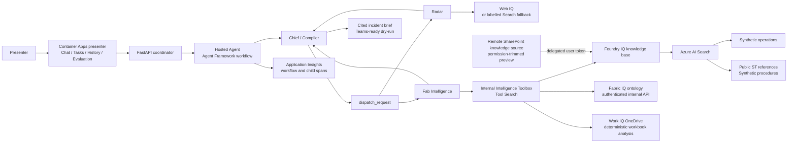

# Architecture

## Why three agents

The three roles enforce source and responsibility boundaries inside one observable
Microsoft Agent Framework workflow:

| Agent | Allowed context | Responsibility |
| --- | --- | --- |
| Chief/Compiler | Validated specialist JSON only | Deterministic routing, evidence synthesis, cited incident brief, and Teams dry-run |
| Radar | Web IQ only; accurately labelled Web Knowledge Source fallback while Web IQ is unavailable; no internal identifiers or tools | Public normative, weather, market, and supply context |
| Fab Intelligence | Tool Search over Foundry IQ, Fabric IQ, and delegated Work IQ OneDrive; explicit local fallbacks; no web | Customer/lot exposure, root cause, past excursion, and containment procedure |

The specialists cannot query each other's source. Chief/Compiler has only the
`dispatch_request` function and no retrieval toolbox, so it cannot bypass either
boundary. Each deployed workflow preserves a
single Responses endpoint and parent/child telemetry tree. Teams is not part of the
Internal Intelligence toolbox: its separate toolbox is restricted to one
fixed-recipient write tool and requires server-side presenter approval.

## Runtime flow

1. The presenter starts incident `SIC-QI-2451`, a fictional Vth excursion on
   lot `SiC-AUTO-2451`.
2. The Chief/Compiler classifies the request and activates only Radar, only Fab
   Intelligence, or the full parallel assessment.
3. Radar has one evidence tool: **Web IQ**. If the Web IQ connection is not
   configured, deployment keeps the Azure AI Search branch and labels it
   **Web Knowledge Source (Web IQ fallback)**.
   Lot, customer, telemetry, inventory, order, and tenant details are prohibited at
   this boundary and Radar has no internal tool capable of accessing them.
4. Fab Intelligence traces
   `Lot -> Wafer -> Tester -> Recipe -> ETestResult`. It first calls `tool_search`,
   then uses `searchFabricOntology` for causal evidence,
   `analyzeOneDriveWorkbook` for customer and inventory exposure, and
   `knowledge_base_retrieve` for procedures and excursion history. Failed live calls
   use direct local functions with explicit fallback labels.
5. The Chief/Compiler exposes one Agent Framework function tool,
   `dispatch_request`. Deterministic code then invokes Radar only, Fab Intelligence
   only, or the composite workflow; the function is not a Foundry toolbox.
   For composite tasks only, Radar and Fab Intelligence run concurrently. The same
   Chief/Compiler receives both JSON results, keeps citations adjacent to claims,
   separates evidence from hypotheses, and creates accountable actions.
6. Chat shows only the activated specialist trajectory. Tasks display parallel
   progress, provenance, source badges, raw worker JSON, and a Teams-ready draft.
   Delivery remains disabled unless separately configured and explicitly approved.

## Knowledge truth boundaries

| Surface | Current state | Accurate presenter label |
| --- | --- | --- |
| Web source | Web IQ when `st-iq-webiq-mcp` exists; otherwise Azure AI Search public grounding | Web IQ, or Web Knowledge Source (Web IQ fallback) |
| Shipment exposure | Work IQ OneDrive fetch plus deterministic server-side XLSX calculation; local workbook fallback | Work IQ OneDrive live, or Synthetic workbook |
| Public ST references | Live indexed URL metadata and attributed excerpts | Foundry IQ |
| SharePoint | Native `remoteSharePoint` source is validated separately; active Hosted Agent awaits delegated-token forwarding | Foundry IQ SharePoint preview only after validation and promotion |
| Teams | Environment-specific Work IQ connection; fixed recipient, explicit confirmation and approval code required | Teams - dry-run until approved |
| Work IQ | Private OneDrive-only toolbox with read operations; no write/search claim | Work IQ OneDrive live or explicit fallback |
| Fabric IQ | F2 workspace, Lakehouse, five Delta tables, graph refresh, and ontology MCP query | Fabric IQ live through the internal API; local snapshot only when explicitly offline |

Native SharePoint retrieval is explicit and permission-trimmed. It accepts a narrow KQL
path or site filter, uses `x-ms-query-source-authorization`, and stores no token or
tenant content in git. OneDrive is intentionally separate because remote SharePoint
knowledge sources do not support OneDrive content.

## Observability and evaluation

`ENABLE_INSTRUMENTATION=true` sends Agent Framework spans to
`stiqdemo-appinsights`. Expected traces contain `workflow.run`,
Chief/Compiler, Radar, Fab Intelligence, model calls, and toolbox calls under the
same operation ID. Sensitive GenAI content capture remains disabled.

Chief/Compiler loads its baseline from
`agents/hosted/.agent_configs/baseline` through the official
`azure-ai-agentserver-optimization` package. Managed batch evaluation and Agent
Optimizer limitations are reported rather than replaced with fabricated scores.

## Identity and RBAC

| Principal | Role | Scope |
| --- | --- | --- |
| Presenter | Foundry User | Foundry project |
| Presenter | Search Service Contributor / Index Data Contributor | Search |
| Presenter | ACR Tasks Contributor / Repository Writer | ACR |
| Foundry project identity | Foundry User | Foundry account |
| Foundry project identity | Search contributor/reader roles | Search |
| Hosted agent identity | Foundry User | Foundry account |
| Hosted agent identity | Search Index Data Reader | Search |
| Delegated presenter | Read access through a short-lived user token | Fabric ontology MCP |
| Radar toolbox | Web IQ connection or project connection to Azure AI Search web knowledge base | Current public evidence |
| Internal Intelligence toolbox | Foundry IQ, authenticated Fabric API, authenticated OneDrive analysis API | Tool Search discovers the evidence-domain tool |
| Foundry Work IQ toolbox | Private environment-specific OneDrive connection | Delegated workbook read only |
| Presenter web identity | Foundry User | Foundry project |
| Presenter web identity | ACR Repository Reader | ACR |

The public app stores no Foundry secret. Its user-assigned identity obtains an Entra
token for the Hosted Agent Responses endpoint. Chat and task history is intentionally
in-memory with one Container Apps replica; a revision restart clears it.

## Agent and tool inventory

| Agent Framework agent | Attached tools in V1 | Current live behavior |
| --- | --- | --- |
| Chief/Compiler | `dispatch_request` | Deterministically selects one route and synthesizes the parallel specialist results |
| Radar | Market toolbox only | Web IQ when configured, otherwise the labelled Search fallback; no internal tool or data |
| Fab Intelligence | Internal Intelligence toolbox plus three direct local fallbacks | Tool Search discovers Foundry IQ, Fabric IQ, or Work IQ OneDrive; no workbook bytes enter model context |

A toolbox is a hosted connection/versioning/allowlist boundary, not an agent.
`st-iq-internal-intelligence` uses Tool Search even though it has only three business
tools: the value is demonstrating dynamic capability discovery and a scalable pattern,
not reducing context at this size. Every tool has a precise description and
`additional_search_text`; the version-specific endpoint is pinned, no business tool is
pinned, and Fab is instructed to search before declaring a capability unavailable.
`st-iq-workiq-teams-toolbox` remains separate and exposes only `SendMessageToUser`.
